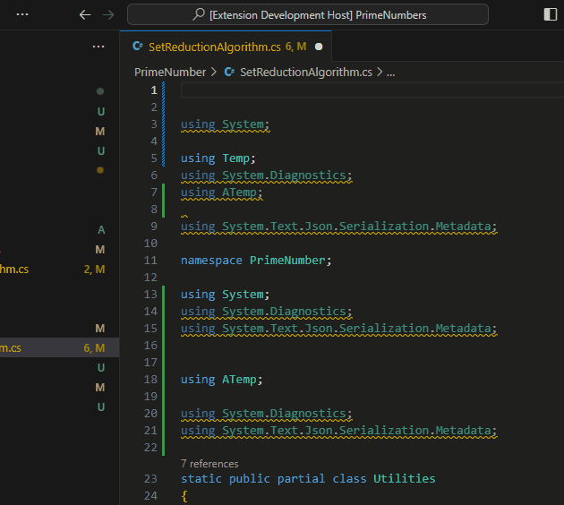

# C# Code Polisher README

It's an extension for **VSCode** under **Roslyn LSP** manage. The extension provides ability to sort and remove unnecessary usings in single C# lang files and in workspace.

**IT WON'T WORK FOR ANY OTHER LSP (FOR OMNISHARP ALSO)**.

## Features

Extension allows to do the chores for C# usings via VS code command palette. Keep in a mind that removing of unnecessary usings can be executed successfully only when LSP finishes its checks. So you need to wait until LSP to light up files in workspace before using the extension. 

1. Shift + Command + P (Mac) / Ctrl + Shift + P (Windows/Linux)
2. Insert 'CodePolisher'
3. Choose the option 

## Requirements

Extension works for VS Code editor (1.85.0 and higher) that uses Roslyn LSP. This extension will not work for Omnisharp LSP or any other due to differences in structure of diagnostics data that different LSPs collects. 

If you wish to have ability to clean unnecessary usings for closed files of a workspace, then you have to add line to `.vscode/settings.json` of the project or of a user:

`"dotnet.backgroundAnalysis.analyzerDiagnosticsScope": "fullSolution"`

Because in other way analyzer will not execute diagnostics for closed files. In this case function for fixing usings in workspace will fix only documents that are opened in editor.

## Extension Settings

This extension contributes the following settings:

* `cscodepolisher.saveOnEdit`: boolean - `false` by default. If it is `true` then fies will be saved after edit.
* `cscodepolisher.excludePathFromChecking`: GlobPattern - you can add files to exclude check for them.

You can change them in Settings menu for certain project or for user

### 0.0.2

* Split functions on 3: sort, remove and clean up (sort+remove)
* Add option to save on edit `cscodepolisher.saveOnEdit` which is switched off by default

### 0.0.1

Initial release. Let's go!