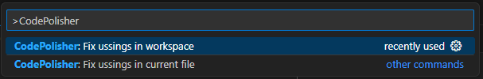

# C# Code Polisher README

It's an extension for **VSCode** that provide ability to sort and remove unnecessary usings in single C# lang files and in whole project in VS Code using **Roslyn LSP**.

**IT WON'T WORK FOR ANY OTHER LSP (FOR OMNISHARP ALSO)**.

## Features

Extension allows to do the chores for C# usings via VS code command palette. Keep in a mind that removing of unnecessary usings can be executed successfully only when LSP finishes its checks. 

1. Shift + Command + P (Mac) / Ctrl + Shift + P (Windows/Linux)
2. Insert 'CodePolisher'
3. Choose the option 



## Requirements

Extension works for VS Code editor (1.85.0 and higher) that uses Roslyn LSP. This extension will not work for Omnisharp LSP or any other due to differences in structure of diagnostics data that different LSPs collects. 

If you wish to have ability to clean whole project from unnecessary usings you have to add next line to `.vscode/settings.json` of the project or of a user: 
```
"dotnet.backgroundAnalysis.analyzerDiagnosticsScope": "fullSolution"
```
Because in other way analyzer will not make diagnostics for files that are closed. In this case function for fixing usings in workspace will fix only documents that are opened in editor.

## Extension Settings

This extension contributes the following settings:

* `cscodepolisher.removeUnnecessaryUsings`: boolean - you can set to `false` if you wish to sort usings only .
* `cscodepolisher.excludePathFromUsingsFormatter`: GlobPattern - you can add files to exclude check for them.

You can change them in Settings menu for certain project or for user

### 0.0.1

Initial release. Let's go!